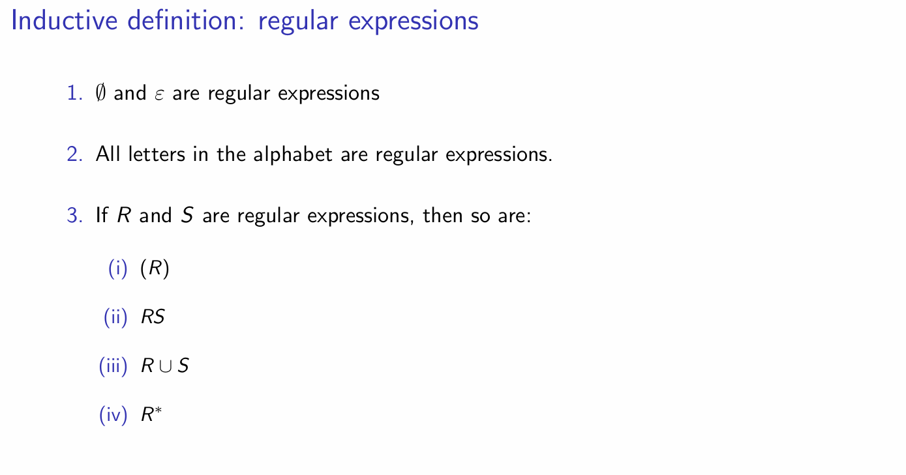
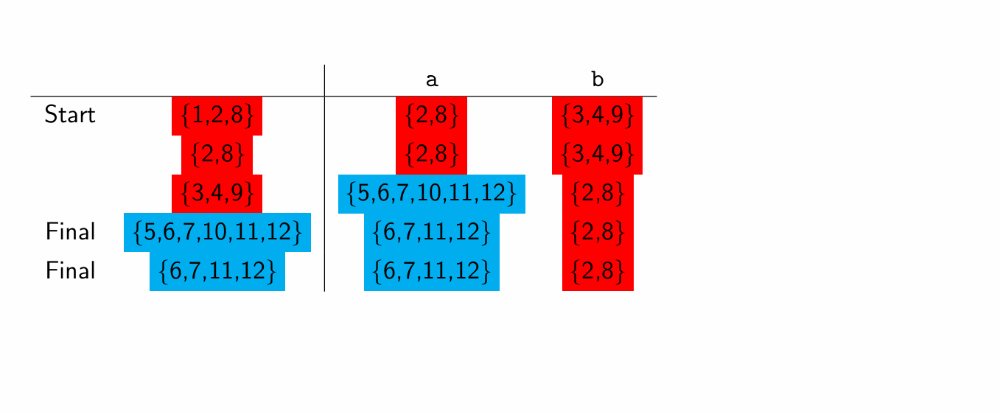
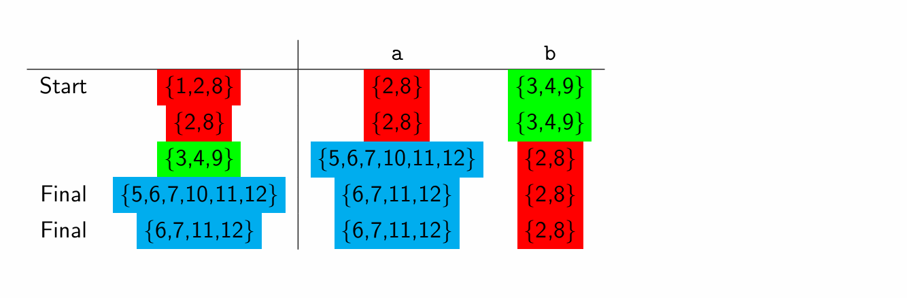
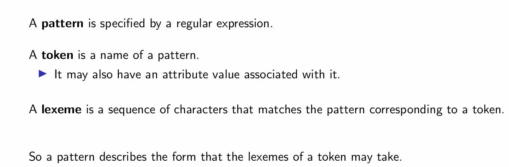
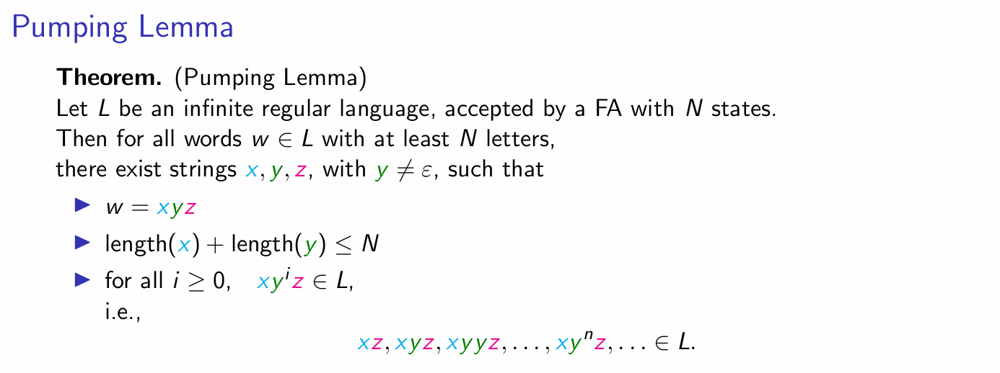

# FIT2014: THeory of Computation

## week 1

### 1 Language

**language, alphabet, letters/characters, word, empty word, empty language & universal language, EVEN-EVEN, DOUBLEWORD, PALINDROMES**

To get a **language**, first we need an **alphabet**. Members of the alphabet are called **letters** or **characters**. Generally speaking, you can take English as an example, so the alphabet is $\{a, b, c, d,..., z\}$. From alphabet, we can get **word**, which is a *finite string of letters*. The most important feature of word is containing *finite* many letters.

$$\mathsf{DOUBLEWORD} \subseteq \mathsf{EVEN-EVEN}$$

### 2 Propositional Logic

**proposition, truth value, logical operations(negation, conjunction, disjunction, conditional, biconditional), connective, tautology, logically equivalent, De Morgan's Law, Distribution Laws, DNF, CNF, literals, clause**

A **proposition** is a statement either true or false. For example: 

Propositions have **truth values**, which are **True** and **False**. It also have **logical operations**, and the binarys are called **connectives**.

To simplify propositional logic sentences, there are some very useful tools: **De Morgan's Laws**, **Distributive Laws**. Another way is truth table.(To prove logically equivalence)

A **tautology** is a proposition which is always true. **Logically equivalent** means they have the same truth table.

Some forms are very important: **disjunctive normal form(DNF)** and **conjunctive normal form(CNF)**. DNF is disjunction of conjunctions of **literals**, and CNF is conjunction of disjunctions of literals, and each disjunction is called **clause**.

> Every logical expression is equivalent to a DNF(CNF).

### 3 Predicate Logic

**predicate, domain, argument, k-ary, constants, quantifiers(existential, universal)**

A **predicate** is a statement with variables/**argument**, which has **domain**, and if every variables are assigned truth value, then the statement become a proposition. A predicate is **k-ary** if it has k varibales. Functions with no argument are called **constants**.

Roughly speaking, **predicate logic** consist of statements with variables, and when the variables are decided, the predicates become propositions.

Predicates can be understood as functions, whose codomain is {T, F}.

**Quantifiers**: existential and universal, and combine them we can get multiple quantifiers. 

### sample question 1

Use Boolean algebra to get CNF.
Also doing logic reasoning, but this time with quantifiers.

## week 2

### 4 Proofs

the ways of doing proof:

- construction
- cases
- contradiction
- induction

### 5 Proofs: the Good, the Bad and the Ugly

Proofs can be good, bad or ugly. Bad proofs means wrong proofs, and ugly proofs, for example, using contradiction when not necessary.

### 6 Regular Expressions

**regular expression, regular language**

Using regular expression, we can define **regular language**. 

A very important work is finding correspongding regular expression of a language from its description.

### sample question 2

induction method

## week 3

### 7 Finite Automaton

**finite automaton(FA), state, transition, accepted, rejected, recognise, complement, NFA**

Finding the complement of an FA: exchange the final states and non-final states.

For FA, given a state and a letter in the alphabet, then there will be a unique transistion, but for NFA, there might be multiple transitions or no transition. Also, empty word is allowed as a label.

### 8 Kleene's Theory 1: Regexp → NFA → FA

#### Regular expression → NFA

#### NFA → FA

Just pack the states of NFA to some new state in the FA.

- Start state is $\mathsf{endState}(\varepsilon)$
- then construct $\mathsf{endState(a)}$ and $\mathsf{endState(b)}$
- then aa ,ab, bb. ba...

### 9 Kleene’s Theorem 2: FA → Regexp

**GNFA, standard GNFA**

#### FA → GNFA

#### GNFA → regular expression

Just making sure that this process is done for every pair of non-final state to non-start state. But have to notice that to eliminate a state, we must make sure that every pair that can make use of this state as a bridge must be considered.

> Hence in fact the set of regular language and the language recognised by an FA is the same set.

### smaple question 3

induction with FA

## week 4

### 10 Simplifying Finite Automata, and Lexical Analysis

**pattern, token, lexeme**

Grouping the states of FA until all different kinds of group has its own pattern. Starting from just separating the final and non-final states.

### 11 (A) Closure properties; (B) Pumping Lemma for Regular Languages

**closed, circuit, pumping lemma**

Regular languages are **closed** under some operations:

- complement
- intersection
- union
- concatenation
- symmetric difference

---

For a regular language, if a word $w$ is long enough, then it will contain a circuit. This lemma is usually used to prove a language is not regular.

Hence we also know that there are some languages not regular.

## week 5

### 12 CFGs

How to find the CFG of a language?

There is no exact algorithm, but some **useful tricks**:

- union $L_1\cup L_2$: $S\to S_1\mid S_2$
- concatenation $L_1L_2$: $S \to S_1S_2$
- Kleen Star $L^*$: $S\to S_1S\mid \epsilon$
- work from the outermost, for example, $L=\{a^nb^n\}$, we can set rule $S\to aSb\mid \epsilon$

To show that $L(G)=L$. we can decompose it into $L(G)\subseteq L$ and $L\subseteq L(G)$. For the first case we usually induct the steps we use or the height of the parse tree, and for the second case we usually induct the length of the word.

### 13 Regular Grammars and Pushdown Automata

#### convert NFA to CFG

- convert states of NFA into non-terminals
- convert transitions like $X\xrightarrow{z}Y$ into $X\to zY$
- for every final state $X$ create rule $X\to \epsilon$

So every regular language is a context-free language.

#### Regular Grammar

**Semiwords** are words in form: some terminals followed by one nonterminal at the last position.

A CFG is called a **regular grammar** if all its production rules are in form: 

- nonterminal to semiword
- nonterminal to string of terminals

> Every Regular Language can be generated by a Regular Grammar.

Because every NFA can match a CFG, and by the generating process we can know that the grammar is regular. 

> Every Regular Grammar can generate a Regular Language.

But there doesn't have a bijection because although a regular grammar generates unique reguler language but a regular language may be generated by a lot of regular grammars.

#### Pushdown Automata

So for regular language we have NFA, a natural question is: for CFLs, does there exist an automata to represent them?

A **Pushdown Automata** is an NFA with a stack, which can memorize the the letters have been read. Every transition of a Pushdown Automata is in the form $x, y\to z$, which means when read $x$ and the top letter of the stack is $y$, then change $y$ to $z$.

A Pushdown Automata can be used to represent a CFG.

### 14 CFL and PDA

#### CFL to PDA

Leftmost derivation:

- statrting from 4 basic states, and then adding more states for each transition rules

Every string in $L$ exactly has a leftmost derivation.

#### PDA to CFL

1. First we need to make some simple modifications to PDA M:

- ensure that there is only one Final State and when reach it the stack is empty, we do this by adding $, start state and a loop to clear the stack
- each transition either pushed or pops

Define the non-terminal symbol $A_{pq}$ to indicate that starting at p with empty stack and ending at q with empty stack. 

2. Here we make the rules:

- $A_{pq} \to A_{pr}A_{rq}$ if at state $r$ the stack is also empty
- $A_{pq} \to xA_{p'q'}y$
- $A_{pp}\to \varepsilon$
- $S\to A_{st}$

## week 6

### 15 Parsing

Given a CFG and a string of letters, **parsing** is the process to find out whether the string fit the grammar, and if it is, finding a parse tree. And a **parser** is a program to do this thing.

There are 2 main types of parsers:

- top-down: starting from S, and use production rules to generate the string.
- bottom-up: reducing the string to S.

Some grammars have more than 1 way to generate a word, which means that the grammar is **ambiguous**.

#### LR parser

It's a bottom-up parser, which scans the input word from left to right, and implememnt the production rules from the rightmost side, reversely. For example, a **Shift-Reduced Parser**, which is an LR parser, consisting of a **stack** and a **buffer**. The stack is initially empty and the buffer is initially the string. **Shifting** means put the leftmost letter to the stack and **reducing** means implementing the rules to the rightmost part of the things in the stack.

Sometimes there are shift-reduce conflicts, which means for the things in the stack now, we can choose to do shifting or reducing. It's a kind of ambiguous. Similarly, we may also encounter reduce-reduce conflicts and other kinds of conflicts.

#### Tools

**YACC** (Yet Another Complier-Complier) is a kind of parser-generator. Inputing a CFG it will output a parser. It resolve conflicts by making some rules:
for shift-reduce, it will execute shift first, and for a reduce-reduce one, it will execute the rule listed first.

<!-- ? -->
Lex is a lexical analyser, whose input is a regular expression and output a lexical analyser.

### 16 Chomsky Normal Form

**CNF** is a special kind of CFG that only with 2 kinds of productions:

- Nonterminal to Nonterminal Nonterminal
- Nonterminal to Terminal

>Theorem. For any CFL, every nonempty word can be generated by a grammar in CNF.

CNF is convenient when we try to find the parse tree that generate the word.

How to convert a CFG to the CNF:

- eliminate all $\varepsilon$-production
- eliminate all unit productions

#### Nullability algorithm

To decide whether a CFG can generate the empty word, we use the concept: **nullability**. We mark the nonterminals that can produce $\varepsilon$ step by step, and if eventually $S$ is marked, then $\varepsilon$ is accepted.

#### Cocke-Younger-Kasami (CYK) algorithm 

Given a word $s$ and a CFG, we can decide whether $s$ can be generated by grammar, by CYK algorithm:

1. If $s$ is empty, use the nullability algorithm.
2. Otherwise, **find the CNF of the grammar**, and then **finding out whether this word can be generated by the CNF**. 

### 17 Pumping lemma for CFL

Generally speaking, for word that longer enough in a CFL, there will exist a somekind loop in the word, because the number of nonterminals is finite in the grammar.

> Let $L$ be any context-free language that has a CFG in CNF with $k$ non-terminal symbols. Then for every word $w\in L$ with $> 2^{k-1}$ letters, there exist strings $u,v,x,y,z$ with $vy\neq \varepsilon$, such that 
>
> - $w = uvxyz$
> - $\mid vxy \mid \leq 2^k$
> - for all $i\geq 0$, $uv^ixy^iz\in L$

Hence by using pumping lemma, we can prove that some languages are not context free.

### Sum up exe6

- Find CFG for a given language
- Find PDA for a given language
- regular grammar
<!-- ? -->
- how to prove a regular expression is for the given language?
- CNF, convert CFG to CNF
- convert PDA to CFG
- CYK algorithm
- 

## week 7

### 18 Turing machines and computability

A **Turing Machine** consists of a **Tape**, **Tape Head**, **Program** and **Computation**.

The tape is an infinite sequence of cells, and each cell may contain a letter from a finite alphabet. At the initial stage, the tape only contains the input string and then all followed by blanks.

The tape head is positioned at one cell at any time, and it can read the letter from the current cell, write a letter to the current cell, and move left or right.

The program consist of a set of numbered states, including **Start State (1)** and **Accepted State (2)**, At any time, the machine is in one state, and initially in the start state. For each state and symbol, the **transition** decides the next state, symbol and direction.

A Turing Machine can determine languages by $\mathbf{Accept}(T)$, $\mathbf{Reject}(T)$ and $\mathsf{Loop}(T)$.

A **decider** is a Turing Machine $T$ without a loop, i.e. the $\mathsf{Loop}(T)$ = $\empty$. $T$ is a **decider for** language $L$ iff $\mathbf{Accept}(T) = L$. $L$ is **decidable** if it has a decider $T$.

#### FA to TM

>Every regular language has a decider. 

Any language defined by a Turing Machine's $\mathbf{Accept}(T)$ can also be defined by some other machines, for example, Queue automaton, 2PDA, NTM  and kTM. 

A function is **computable** if it is the function computed by some Turing machine.

#### Church-Turing Thesis

>Any function which can defined by an algorithm
can be computed by a Turing Machine.

Note: not a Theorem! But widely accepted.

### 19 Universal Turing Machines

We can make **a table of a TM**, and the table header consists of From, To, Read, Write and Move.

By **encoding** the State number, Letter and direction with some strings, we can use a string to represent every raw in the table, and by concatenating every raw, we can represent the table by a very long string!

> a Turing machine $\to$ a table $\to$ a string

**Code-Word Language (CWL)**

$$
(aa^*baa^*b(a \cup b)^5)^*
$$

Any words that encode a TM belong to CWL. But not vice versa.

In the other direction, we can **decode** a word into a Turing Machine.

A **Universal Turing Machine(UTM)** take an encoding of an TM $M$ and a input word $x$ of $M$, and then simulating the execution of $M$ on $x$. For example, to open a document in format `.md`, we need a specific viewer, which is $M$, and the document we want to open is $x$.

## week 8

### 20 Decidability

A **decision problem** is a problem, where for each input, the answer is Yes or No. A decider **solves** a decision problem if it accepts an input when the answer is Yes and rejects an input when the answer is No. There is a bijection between the decision problem and the decidable language.

relationship:

$$\text{regular language} \subseteq \text{CFLs}\subseteq \text{decidable language}$$

<!--  -->

The **closure property of decidable language**: complement, union, intersection, concatenation.

### 21 Mapping Reductions

A **mapping reduction** from language $K$ to language $L$ is a **computable** function $f: \Sigma^*\to \Sigma^*$ such that $\forall x\in \Sigma^*$, $x\in K \iff f(x) \in L$.

归约映射可以理解成，问题 K 比 L 更容易。

Here **computable** means there exist a Turing machine, with input $\omega$, after finite many steps, can write $f(\omega)$ and halt.

> If $L$ is decidable then $K$ is decidable.

> Mapping reducibility is transitive.

> If $L_1$ is decidable and $L_2$ is any language except $\empty$ and $\Sigma^*$, then $L_1\leq_m L_2$.

## week 9

### 22 Undecidability

#### Halting Problem

The set of all deciders is countable, since the CWL-encodings of deciders is a subset of CWL, and CWL is a subset of $\Sigma^*$.

and $\Sigma^*$ is countable, so the set of all deciders is countable.
<!-- Lec5 -->

And the set of all languages is not countable, so *there exist undecidable language*.
<!-- why all language set is uncountable? -->

**Halting Problem** is: input a turing machine $P$ and a string $x$, and let $P$ run with $x$, does it eventually halt?

i.e. there isn't exist a Turing machine $H$ that can decide for every input $(M,x)$ whether it will halt.

Then we can define the language:

$$\mathsf{HaltingProblem} := \{\langle P,x\rangle : \text{when P is run with x, it eventually halt}\}$$

i.e. all the input that can make the answer Yes of the problem.

#### Proof of its undecidability

> Theorem. The Halting Problem is undecidable.

Proof by contradiction. If there is a decider D, then for any P and x, we can decide whether or not P will halt after reading x:

$$D(P,x)\in \{H, L\}$$

Now let P read P: construct another Turing machine E, for the input Q, if $D(Q,Q) = H$, then E output loop forever, else if $D(Q,Q) = L$, E output halt. Then with E read E, there will be a contradiction.

#### Using mapping reductions to prove undecidability

> Mapping reduction maps undecidable language to undecidable language.

**DIAGONAL HALTING PROBLEM**: for Turing machine P, does P halt for input P? This problem is undecidable from the above proof.

**HALT FOR INPUT ZERO**: for Turing machien P, does P halt for input 0? This problem is also undecidable, we can prove it by mapping reduction from the DIAGONAL HALTING PROBLEM.

Let M be any Turing machine, we can construct M': for input x, run M on input M. Then

- M $\mapsto$ M' is computable
- M run M halt iff M' run 0 halt

#### Other undecidable problems

HALT FOR INPUT 42: we can change 0 into other numbers since there is no speciality of 0.

ALWAYS HALTS: input turing machine P and ask does P always halt for any input? This problem is undecidable.

SOMETIMES HALTS: input turing machine P and ask is there some input for which P eventually halt? This problem is undecidable.

NEVER HALTS: input turing machine P and ask does P always loop forever for any input? This problem is undecidable.

### 23 Recursively enumerable languages

#### recursively enumerable languages

A language $\mathsf{L}$ is **recursively enumerable** if there exists a Turing Machine $\mathsf{T}$ such that $\mathsf{Accept(T)=L}$, but strings outside $\mathsf{L}$ may be rejected or may make $\mathsf{T}$ loop forever, which is very different from the decidable languages since the decider can only accept or reject.

So recursively enumerable language set contains more languages than decidable language set.

#### relationship with decidability

For the language $\mathsf{Halt}=\{T:T \text{ halts}, \text{if input is } T\}$. This is the language corresponding to the $\mathsf{Diagonal \ Halting \ Problem}$ so it's not decidable, but recursively enumerable, since we can construct a UTM, and let it accept those T in $\mathsf{Halt}$.

> Theorem. A language is decidable if and only if both it and its complement are r.e.

Also, there do exist some languages not r.e.

#### enumerators

An **enumerator** is a Turing machine which outputs a sequence of strings, this sequence can be finite or infinite, and for infinite case the enumerator will never halt. It never accepts or rejects; it just keeps outputting strings and may stop. 

A language $L$ is **enumerated** by an enumerator $M$ if 

$$L = \{\text{all strings in the sequence outputted by }M\}$$

Orders and repetition don't matter.

> Theorem. A language is r.e. iff it is enumerated by some enumerator.

#### non-r.e. languages

$\overline{\mathsf{Halt}}$ is not r.e.

### 24 Polynomial time, and the class P

#### Time complexity

For the Turing machien M, $t_M(x):=$ the number of steps M takes for input x until it halts. 

And **time complexity** is the maximum time taken by M for any input of length n.

For the well-definess, we need M halts for all input, i.e. M is a decider.

#### Polynomial time complexity

#### the class P

A language is **polynomial time decidable** if it can be decided by a polynomial time Turing machine. The class of languages decidable in polynomial time is called P.

### Sum up week9

直观地说，decidability 判定的是一个问题会不会陷入循环，而递归可枚举性判定的是

## week 10

## week 11

### 29 Proof of Cook-Levin Theorem 

> Cook-Levin Theorem. SAT is NP - complete. 

The key idea is construct a polynomial time reduction form any NP language L to SAT, i.e., for every word x, construct an **CNF expression** $\varphi_x$. Create variables for the **state**, **tape** and **head** to describe the case of the verifier(Turing Machine) and its every move.

## week 12

