## week 7

### 19 Selections and arrangements

**Addition principle** and **Multiplication principle**.

**Ordered selections without repetition**

**Unordered selections without repetition** and **binomial coefficients**

**Ordered selections with repetition**

**Unordered selections with repetition**

I prefer to use equation to understand this case: if we need to put $n$ things in $r$ boxes, then we get a equation:

$$x_1 + \cdots + x_r = n$$

where all $x_i$ are nonnegative integers, so the number of solution is what we want. To solve this problem, we turn the equation into a equation of positive integer variables:

$$y_1 + \cdots +y_r = n + r$$

and then using the idea of **stars and bars**, there are $n+r-1$ positions for us to put bars in, and in total we should put $r-1$ bars to get $r$ parts, so the number of solution is $\binom{n+r-1}{r-1}$.

**pigeonhole principle**

### 20 Pascal’s triangle

**Symmetric property** and $\binom{n}{r} = \binom{n-1}{r} + \binom{n-1}{r-1}$.

**The binomial theorem**

**Inclusion-exclusion**

### 21 Probability

A **probability space** consist of a **sample space** and a **probability function**. An **event** is a subset of the sample space.

**mutually exclusive** $:= P(A \cap B) = 0$.

**Independent events** $:= P(A \cap B) = P(A)P(B)$.

### Sum up of exe7

1. caculating factorial, binomial coefficients.
2. Know how to pick 
   1. several different things
   2. several things
   3. repeatedable choice
   4. permutation of several things
3. Pigeonhole principle
4. Binomial theorem
5. classical probability, product rules, Conditional probability, independence

## week 8

### 22 Conditional probability and Bayes’ theorem

$$P(A|B):=\frac{P(A\cap B)}{B}$$

Independent

Independent repeated trials

Bayes’ theorem

$$P(A|B) = \frac{P(B|A)P(A)}{P(B|A)P(A)+P(B|\overline{A})P(\overline{A})}$$

Law of total probability

### 23 Random variables

Probability distribution

Independent random variables

Operations

Sums and products

### 24 Expectation and variance

Expected value

Law of large numbers

$$\lim_{n \to \infty} \frac{1}{n} (X_1 + \cdots + X_n) = \mu.$$

Linearity of expectation

Variance

## week9

### 25 Discrete distributions

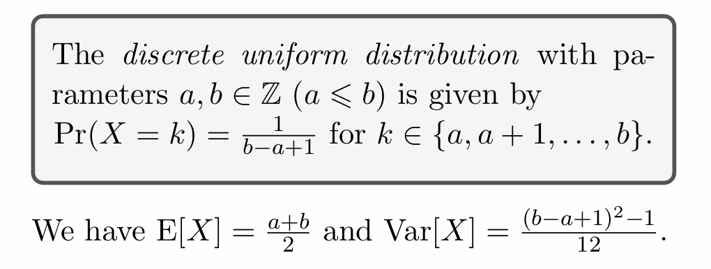
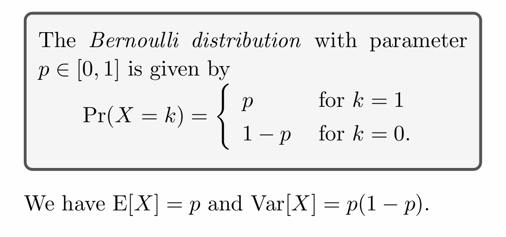
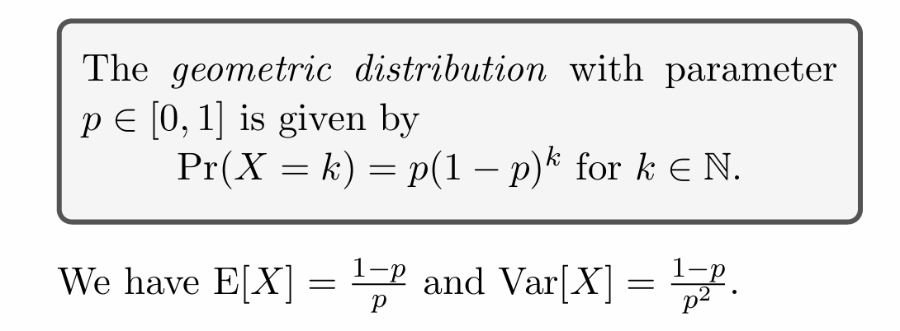
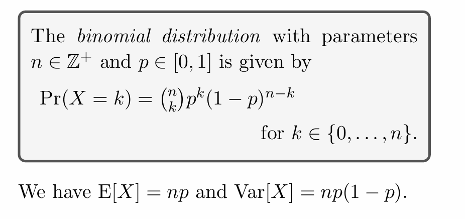
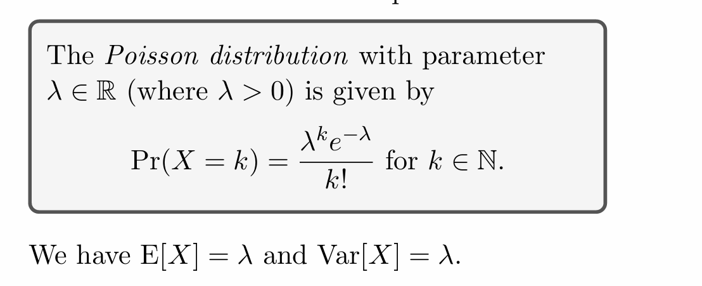

### 26 Recursion

**Recurrence relation** and **initial value** for the definition of $f(n)$.

### 27 Recursive Algorithms

Sums, products, Binary search algorithm, Correctness, Running time

## week10

### 28 Recursion, lists and sequences

What is a **list(sequence)**? 
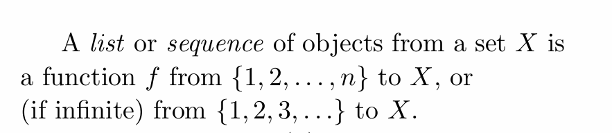

But the terminology sequence sounds more recursive.

e.g. Arithmetic sequence, Geometric sequence(**first order**), Fibonacci sequence(second order)

**homogeneous** recurrence relations
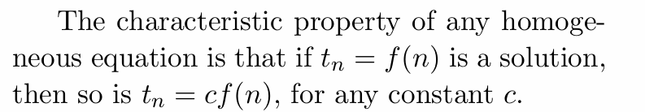

### 29 Graphs

**Graph**, **vertices** and **edges**
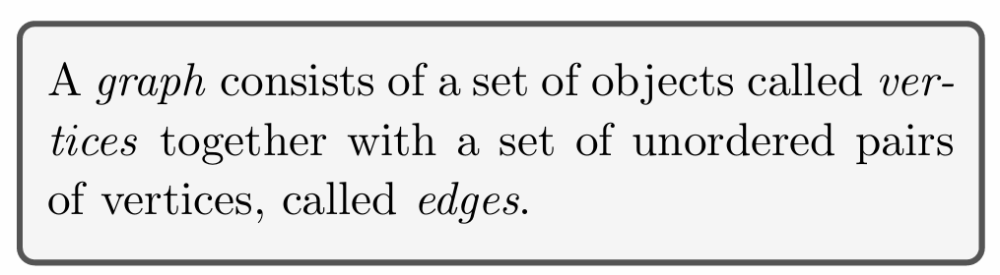

**Multigraphs** can contain more than one edge between two vertices or have loop on one point, while we use **simple graph** to emphasise this is not a mutigraph. (directed graphs, hypergraphs)

**Complete graph**
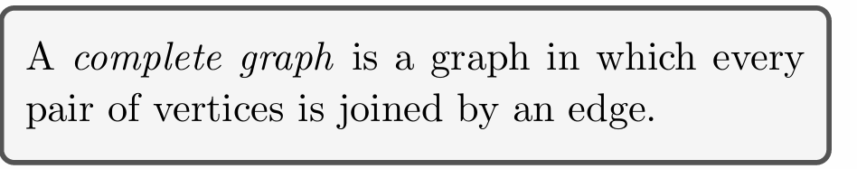

**a path of length $\ell$**
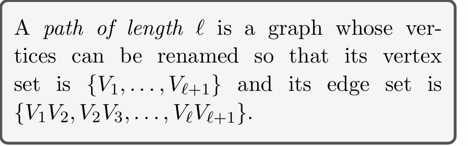

**a circle of length $\ell$**
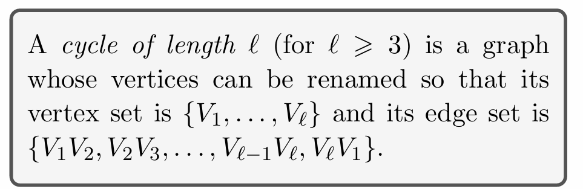

**bipartite** graph and **complete bipartite** graph with parts of size $i$ and $j$
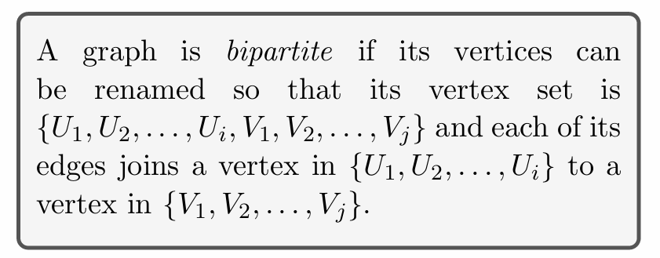

**subgraph**
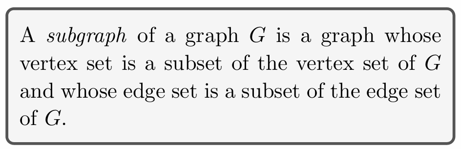

> Theorem. A graph is bipartite iff it has no odd-length circle.

**connected**, **disconnected** and **components**
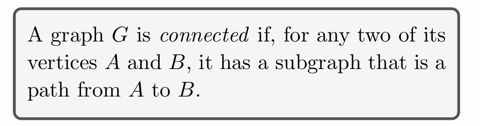

### 30 Walks, paths and trails

**a walk of length $\ell$** and **closed**
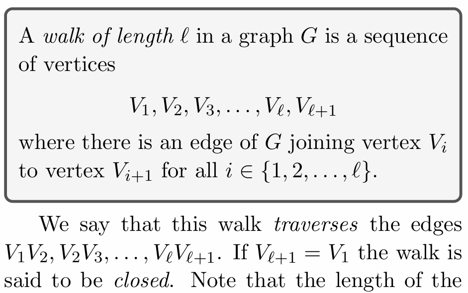
allow 

**trail**
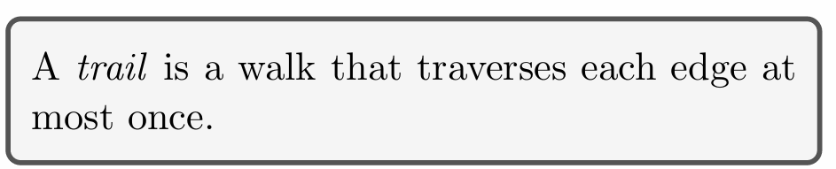

## Summary

这门课给我的感觉更像是一个高中数学+一试的简单版集合体，覆盖了很多知识，但是都只是浅尝辄止。不过对于一年级新生来说，也算是一门不错的课程。