## section 6

Use dynamic environment to evaluate an expression.

### task 1

- check the definition here to find out is there anything missing?

First we concentrating on the definition in section 4 as a basis. Here is **expressions**:

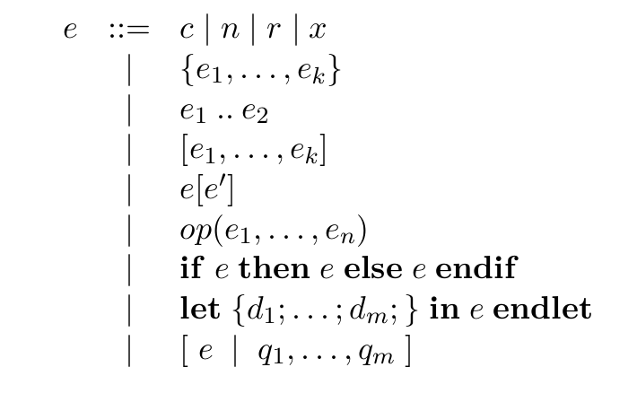

and then comparing with the things we already have in section 6.

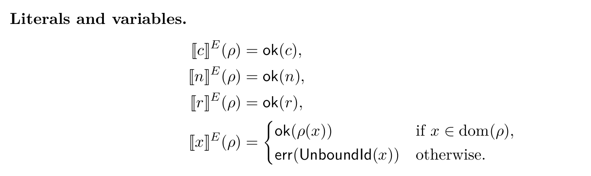
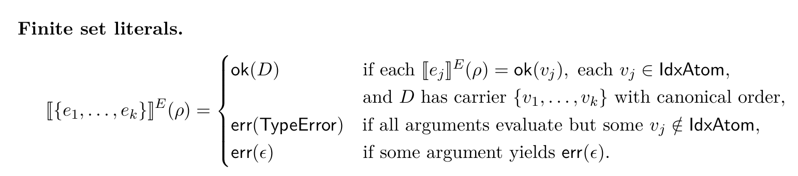
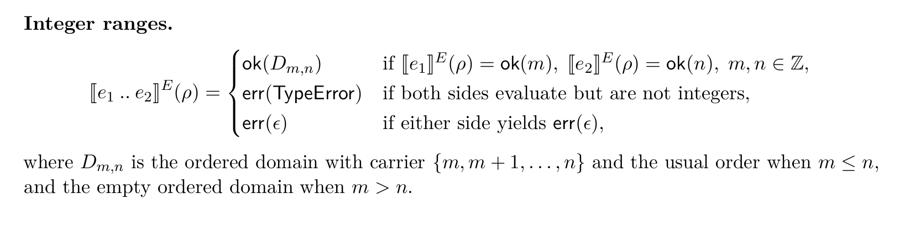
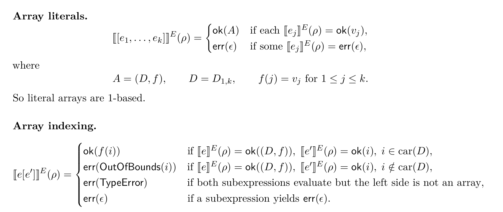
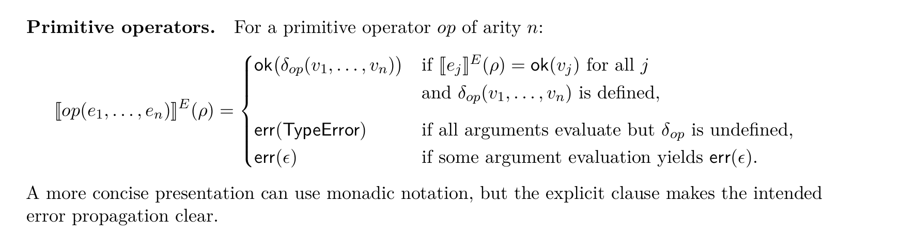
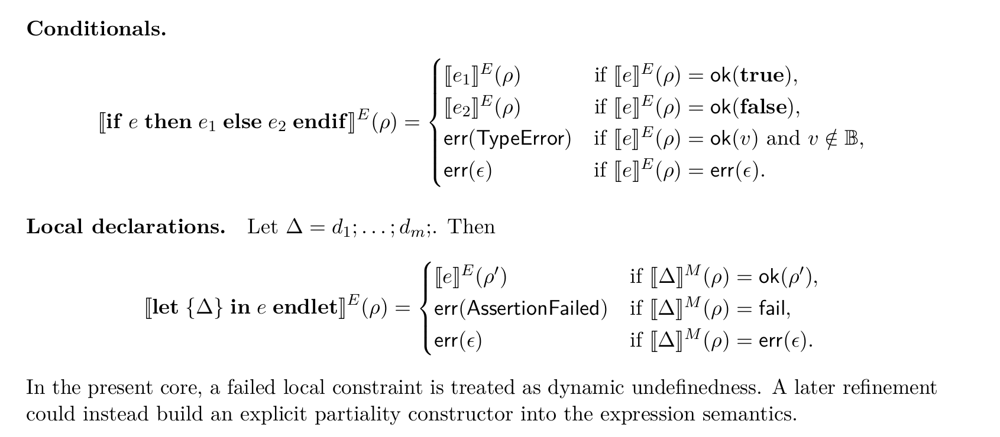

<!-- missing part -->

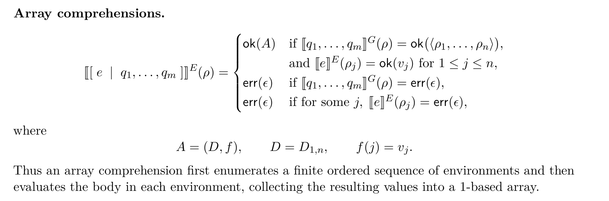

In fact it has been written in the next part.

<!--  -->

Next is **generators**:
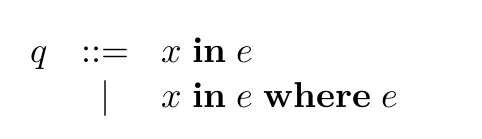

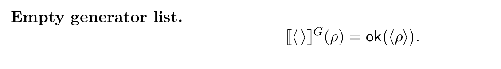
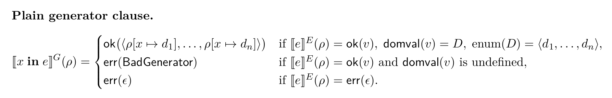
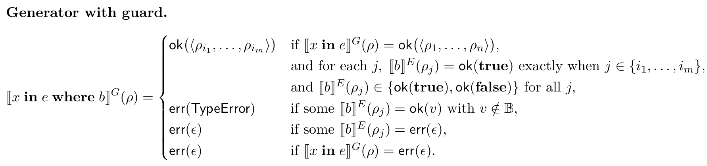
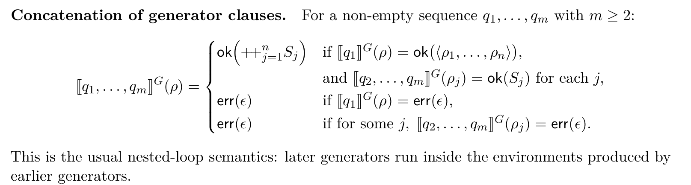

Next is **declarations** and **whole models**:

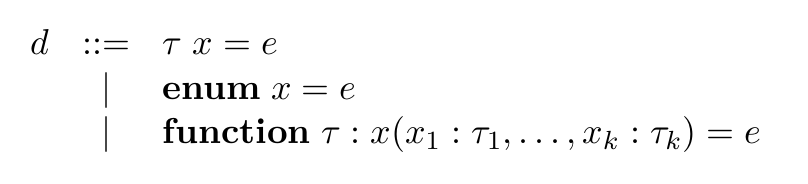

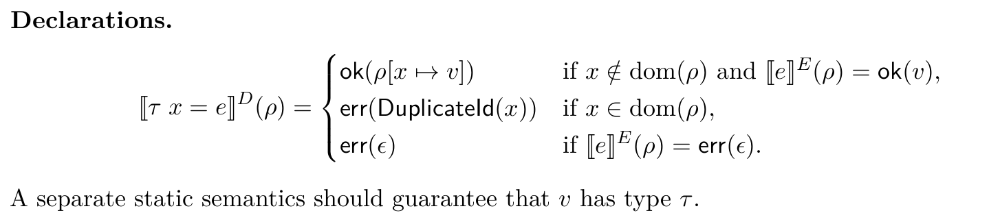

<!-- So enum x = e and function are missing  -->

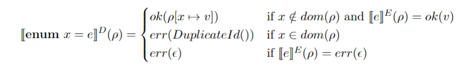
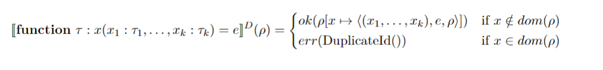

<!--  -->

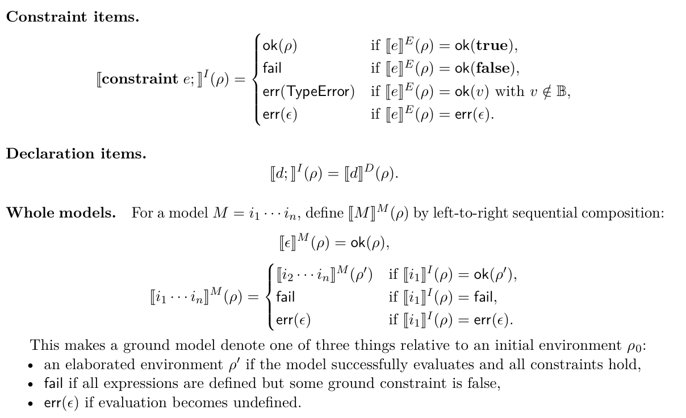

### task 2

- Thinking about how to add user-defined functions and enums into the evaluation as well.

## undefinedness

with the essay

## new task

translate the definition into lean code.
